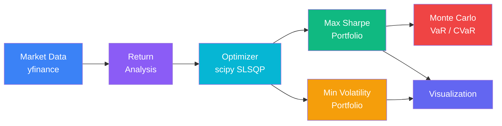

# Portfolio Optimization Engine

Modern Portfolio Theory implementation with efficient frontier computation, Sharpe ratio optimization, and Monte Carlo simulation for asset allocation analysis.

## Architecture



## Features

- **Efficient Frontier** — Generate and visualize the risk-return tradeoff across thousands of random portfolios
- **Sharpe Ratio Optimization** — Find the tangency portfolio maximizing risk-adjusted returns via `scipy.optimize.minimize` (SLSQP)
- **Minimum Volatility Portfolio** — Compute the global minimum variance portfolio
- **Monte Carlo Simulation** — Project portfolio value using geometric Brownian motion with VaR and CVaR estimation
- **Correlation Analysis** — Visualize asset return correlations for diversification insights
- **Portfolio Weight Visualization** — Pie charts and bar plots for optimal allocations

## Technical Highlights

- **Mathematically correct** — Proper Itô calculus formulation for GBM drift term `(μ - ½σ²)dt`, annualized covariance via 252 trading-day convention
- **Constrained optimization** — SLSQP with weight-sum and non-negativity constraints, convergence validation on every solve
- **Reproducible results** — All random processes accept `random_state` parameter for deterministic backtesting
- **VaR & CVaR** — Both parametric risk measures computed from full simulation distribution, not approximation
- **Dirichlet sampling** — Efficient frontier uses Dirichlet distribution to guarantee valid portfolio weights (sum to 1, all non-negative)

## Tech Stack

- **Python 3.10+**
- **pandas** — Data manipulation and time series
- **NumPy** — Numerical computations
- **scipy** — Constrained optimization (SLSQP)
- **matplotlib / seaborn** — Visualization
- **yfinance** — Historical market data

## Quick Start

```bash
git clone https://github.com/nicholim/portfolio-optimization-engine.git
cd portfolio-optimization-engine

python -m venv venv
source venv/bin/activate  # Windows: venv\Scripts\activate

pip install -r requirements.txt
python main.py
```

## Example Output

```
============================================================
Portfolio Optimization Engine
============================================================

Fetching data for AAPL, GOOGL, MSFT, AMZN, JPM, GS...
Generating efficient frontier (5000 portfolios)...
Optimizing portfolios...

------------------------------------------------------------
MAX SHARPE RATIO PORTFOLIO
------------------------------------------------------------
  Expected Return:  28.01%
  Volatility:       30.02%
  Sharpe Ratio:     0.87
  Weights:
    AAPL  : 53.63%
    AMZN  : 12.42%
    GS    : 33.96%

------------------------------------------------------------
MINIMUM VOLATILITY PORTFOLIO
------------------------------------------------------------
  Expected Return:  20.77%
  Volatility:       27.25%
  Sharpe Ratio:     0.69

Running Monte Carlo simulation (10,000 paths)...

  1-Year VaR (95%):  $22,528
  1-Year CVaR (95%): $31,335
```

## Usage

```python
from src.optimizer import PortfolioOptimizer
from src.monte_carlo import MonteCarloSimulator

# Initialize optimizer with tickers and date range
optimizer = PortfolioOptimizer(
    tickers=["AAPL", "GOOGL", "MSFT", "JPM", "GS"],
    start_date="2020-01-01",
    end_date="2024-01-01",
    risk_free_rate=0.02,
)
optimizer.fetch_data()
optimizer.calculate_returns()

# Generate efficient frontier
frontier = optimizer.efficient_frontier(num_portfolios=5000)

# Find optimal portfolios
max_sharpe = optimizer.optimize_sharpe()
min_vol = optimizer.optimize_min_volatility()

print(f"Max Sharpe: Return={max_sharpe.expected_return:.2%}, Vol={max_sharpe.volatility:.2%}, Sharpe={max_sharpe.sharpe_ratio:.2f}")

# Monte Carlo simulation on optimal portfolio
mc = MonteCarloSimulator(
    expected_return=max_sharpe.expected_return,
    volatility=max_sharpe.volatility,
    initial_value=100_000,
)
mc.simulate(num_simulations=10_000, num_days=252)
print(f"VaR 95%: ${mc.calculate_var(0.95):,.0f}")
print(f"CVaR 95%: ${mc.calculate_cvar(0.95):,.0f}")
```

## Project Structure

```
portfolio-optimization-engine/
├── main.py                 # Entry point — runs full analysis
├── requirements.txt
└── src/
    ├── optimizer.py         # PortfolioOptimizer class (efficient frontier, SLSQP optimization)
    ├── monte_carlo.py       # MonteCarloSimulator (GBM, VaR, CVaR)
    └── visualization.py     # Plotting functions (frontier, correlation, weights, returns)
```

## License

MIT
